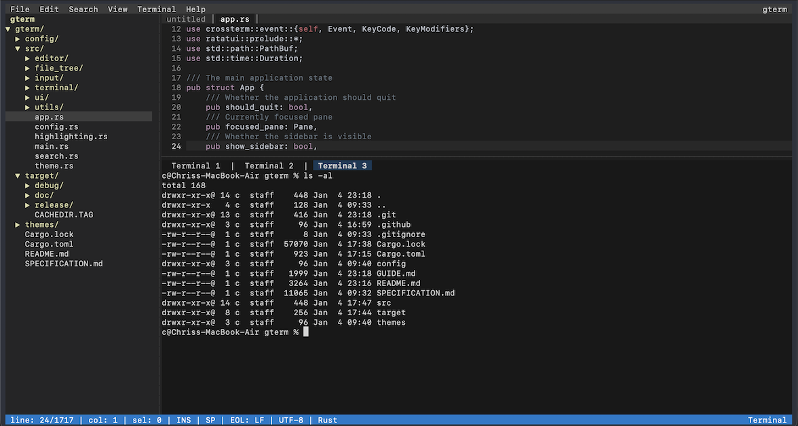

# gterm - The Flyweight IDE in your Terminal

`gterm` is a powerful, stable and lightweight programmer's text editor in the terminal that provides tons of useful features without bogging down your workflow. It runs on Linux, Windows and MacOS. This is a terminal adaptation of [Geany](https://www.geany.org).

## Features

One of the primary reasons for gterm's existence is that there is a need for a decent, TUI (terminal user interface), lightweight, cross-platform, flexible and powerful IDE/editor that can be launched from a shell environment and still offer the point and click utility of a mouse and the standard file keyboard commands that most applications use.

### Core Features

- **Three-pane layout** - File tree (left), code editor (top-middle), and integrated terminal (bottom-middle)
- **Rope-based text buffer** - Efficient text storage using the `ropey` crate
- **Syntax highlighting** - Powered by `syntect` with automatic filetype detection
- **Dark theme** - Geany-inspired dark color scheme
- **Full mouse support** - Drag select, resize panes, context menus, and more

### Editor

- Line numbers with current line highlighting
- Multiple document tabs with keyboard/mouse switching
- Cursor movement (arrows, Home, End, PageUp/Down)
- Text selection (keyboard and mouse)
- Cut, Copy, Paste with system clipboard
- Undo/Redo history
- Delete line, Duplicate line
- Move line up/down
- Auto-indentation
- Bracket matching

### File Operations

- New, Open, Save, Save As, Save All
- Close file/Close all
- File change detection
- Recent files tracking

### Search

- Find dialog with Find Next/Previous
- Replace dialog
- Go to Line

### File Tree

- Directory tree with expand/collapse
- Keyboard navigation (arrows, Enter)
- Mouse click to select and open files
- Respects `.gitignore` rules

### Integrated Terminal

- PTY spawning with `$SHELL`
- VT100 terminal emulation
- Scrollback buffer
- Mouse selection support

### Keyboard Shortcuts

See [GUIDE.md](GUIDE.md) for a complete list of keyboard shortcuts.

### Configuration

Configuration is stored in `~/.config/gterm/config.toml` with options for:

- Editor settings (tab width, spaces vs tabs, auto-indent, line numbers, word wrap)
- Terminal shell override
- UI preferences (sidebar/terminal visibility and sizing, theme)
- File tree options (show hidden files, follow current file)
- Custom keybindings
